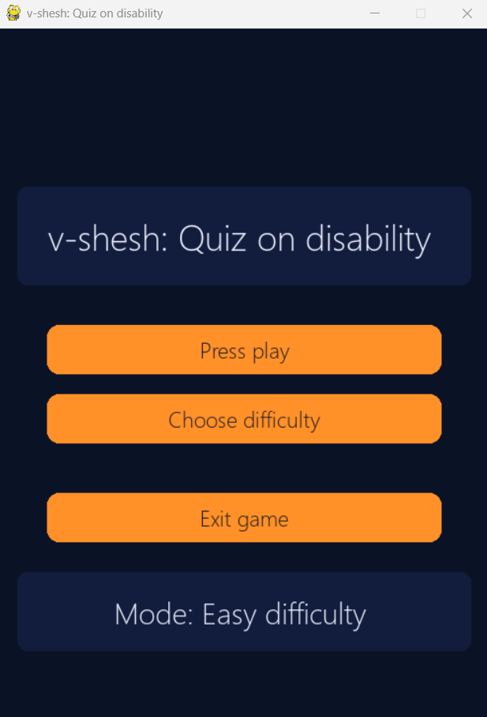
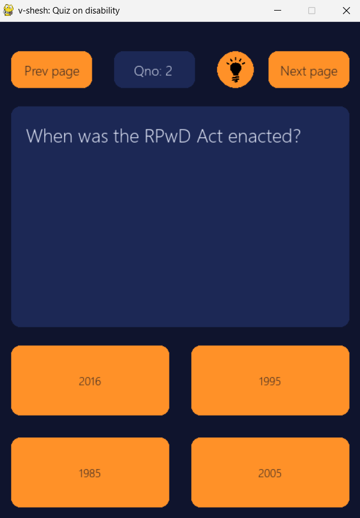
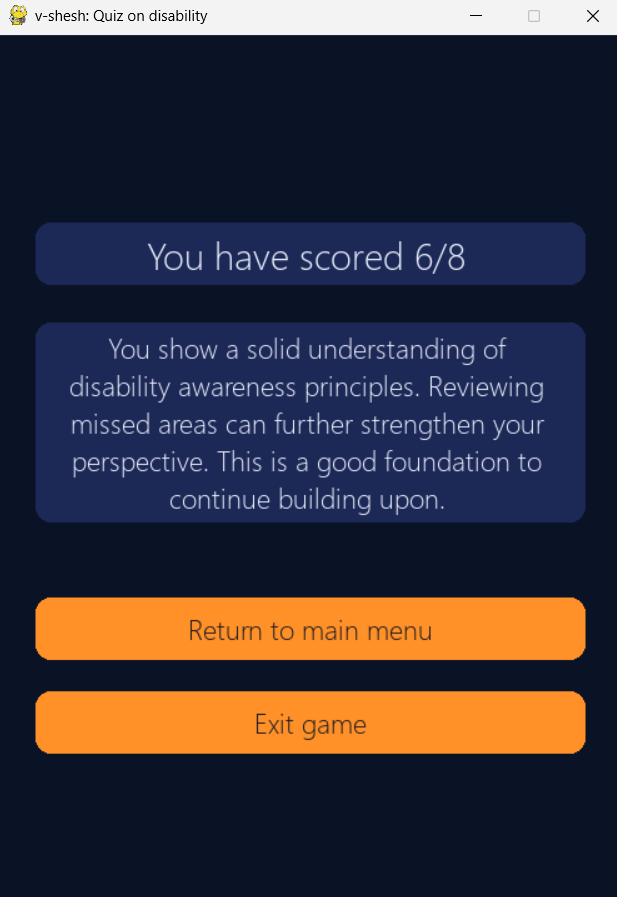

# v-shesh: Quiz on Disability

A respectful and educational quiz game focused on disability awareness and inclusion.

---

## About the Project
 
The goal of the game is to promote understanding of disability, accessibility, and inclusive practices through engaging questions.

This project was created to:
- Raise awareness about different types of disabilities
- Encourage inclusive thinking
- Provide an educational yet interactive experience

## Sample screenshots of the game

### Game main menu page

### Game quiz section page

### Game final result page

## Features

- Multiple difficulty levels (Easy / Medium / Hard)
- Pop-up difficulty selection in the Main menu
- Score tracking
- Dynamic result remarks based on performance

## Built With

- Python 
- Pygame
- PyInstaller (to create the .exe file)

